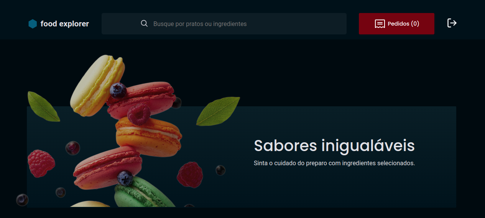

# FoodExplorer Front-end

<p align="center">
  
</p>

Para acessar o projeto no ar, clique aqui [AQUI](https://food-explorer-front-end.netlify.app/) ou visite o repositório [Back-end](https://github.com/HenricoAngolera/food_explorer_backend)

Este é projeto é o front-end do desafio final do Explorer da Rocketseat, ele consiste em um e-comerce de restaurante figurativo. E usei as seguintes tecnologias:

## Stack utilizada

**Front-end:** ReactJS, Vite, Styled-Components, React-Router-DOM, axios, jwt-decode

## Usuários Cadastrados

Para acessar o sistema como usuário administrador, você pode usar as seguintes credenciais no login:

- email: admin@email.com
- senha: 123456

Você pode cadastrar um novo usuário comum, ou usar um já cadastrados:

- email: henrico@email.com
- senha: 123456

## Como utilizar:

Você pode acessar o projeto online: [https://food-explorer-front-end.netlify.app/](https://food-explorer-front-end.netlify.app/) , ou rodar localmente.

Para rodar localmente, siga os seguintes passos:

Primeiramente, você precisa tem instalado Git e NodeJS para executar este projeto.

Com tudo instalado, você pode clonar este projeto, rodando no teminal com a pasta da sua preferência:

```bash
    git clone https://github.com/HenricoAngolera/food_explorer_frontend.git

    # ou

    git clone git@github.com:HenricoAngolera/food_explorer_frontend.git
```

Com o projeto clonado, você entra na pasta que foi criada após esse processo:

```bash
    cd food_explorer_frontend
```

Para instalar os pacotes da pasta node_modules, rodar o seguinte comando:

```bash
    npm install
```

Então, podar o seguinte comando para iniciar o projeto:

```bash
    npm run dev
```

Após isso, acesse em seu navegador o endereço que aparecer no terminal.

## Relacionados

Segue o projeto back-end desta aplicação:

[FoodExplorer Back-end](https://github.com/HenricoAngolera/food_explorer_backend)

## Considerações finais

Estes projetos, tanto o front-end quanto o back-end representam muito do que aprendi nos últimos tempos, fiquei muito satisfeito com minha evolução, mas vou evoluir ainda mais! Este projeto será melhorado ao longo do tempo, obrigado por ler até aqui! 

## Feedback

Se você tiver algum feedback, por favor me deixe saber por meio de henrico.an@gmail.com
